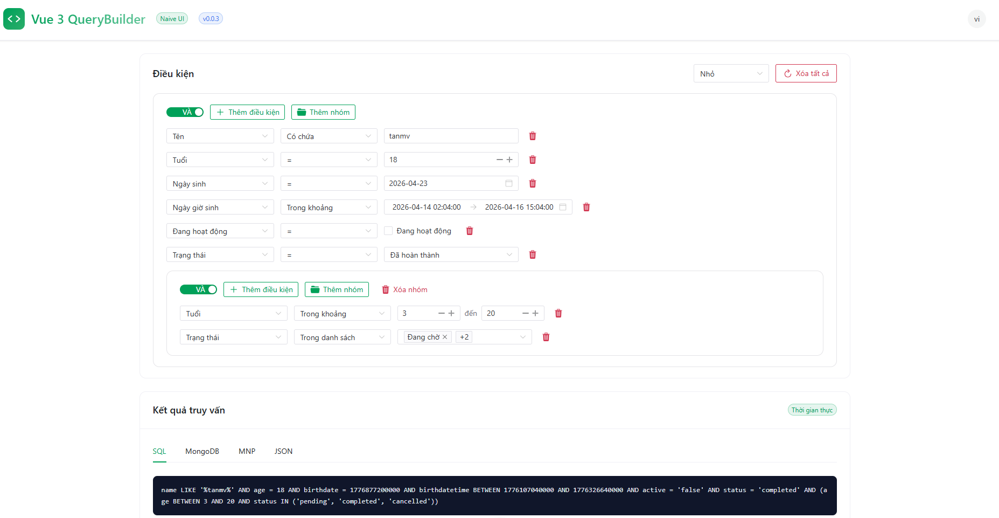
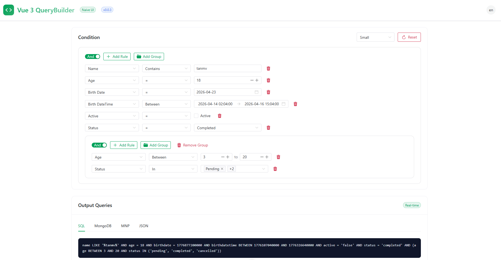

# 🛡️ Vue 3 QueryBuilder (Naive UI)

A powerful, highly flexible, and type-safe query builder component for Vue 3, elegantly crafted with **Naive UI**.

Thành phần query builder mạnh mẽ, linh hoạt và type-safe cho Vue 3, được xây dựng với **Naive UI**.

[](https://www.npmjs.com/package/@mvtcode/vue3-querybuilder-naive-ui)
[](https://github.com/mvtcode/vue3-querybuilder-naive-ui/blob/main/LICENSE)
[](https://vuejs.org/)
[](https://www.naiveui.com/)

---

> [!NOTE]
> This project is a specialized port of [@mvtcode/vue3-querybuilder](https://github.com/mvtcode/vue3-querybuilder). While the original version is built for Element Plus, this version is rebuilt from the ground up to utilize **Naive UI**, providing a more refined, premium aesthetic and deeper integration with Naive UI's component ecosystem.
>
> Dự án này là phiên bản chuyên biệt của [@mvtcode/vue3-querybuilder](https://github.com/mvtcode/vue3-querybuilder). Trong khi phiên bản gốc được xây dựng cho Element Plus, phiên bản này được xây dựng lại hoàn toàn với **Naive UI**, mang lại giao diện tinh tế hơn và tích hợp sâu hơn với hệ sinh thái Naive UI.

---

## ✨ Features / Tính năng

- 🚀 **Modern Vue 3**: Native Composition API and TypeScript support. / Composition API gốc và hỗ trợ TypeScript.
- 🎨 **Naive UI Design**: Premium look and feel out of the box. / Giao diện cao cấp ngay khi cài đặt.
- 🌐 **Deep i18n Integration**: Built-in support for English and Vietnamese. / Hỗ trợ sẵn tiếng Anh và tiếng Việt.
- 🧩 **Advanced Slots**: Dynamic slots for every field with rich context (`isBetween`, `widthValueInput`, `rule`, `filter`). / Slot động cho mọi field với đầy đủ context.
- 🔄 **Multi-format Converters**: Export to **SQL**, **MongoDB**, **MNP**, or parse from SQL/MongoDB. / Xuất sang SQL, MongoDB, MNP hoặc phân tích ngược.
- 📱 **Responsive & Fluid**: Adaptive layouts using Naive UI's Flex and Grid systems. / Layout linh hoạt dùng Flex và Grid của Naive UI.
- 🛡️ **Rule Limits**: `maxOccurrences` to control how many times a field can appear. / Kiểm soát số lần một field được lọc.
- 🌳 **Nested Groups**: Build complex AND/OR logic with configurable depth limits. / AND/OR logic lồng nhau với giới hạn độ sâu tùy chỉnh.

---

## 📦 Installation / Cài đặt

```bash
pnpm add @mvtcode/vue3-querybuilder-naive-ui naive-ui
# or / hoặc
npm install @mvtcode/vue3-querybuilder-naive-ui naive-ui
```

---

## 🔗 Repository

```bash
git clone git@github.com:mvtcode/vue3-querybuilder-naive-ui.git
```

---

## 🚀 Quick Start / Bắt đầu nhanh

```vue
<script setup lang="ts">
import { ref } from 'vue'
import { QueryBuilder, FilterType, Operator } from '@mvtcode/vue3-querybuilder-naive-ui'
import type { QueryBuilderGroup, QueryBuilderFilter } from '@mvtcode/vue3-querybuilder-naive-ui'

const rules = ref<QueryBuilderGroup>({
  condition: 'AND',
  rules: [],
})

const filters: QueryBuilderFilter[] = [
  {
    field: 'name',
    label: 'Full Name',
    type: FilterType.STRING,
    operators: [Operator.EQUAL, Operator.CONTAINS],
  },
  {
    field: 'age',
    label: 'Age',
    type: FilterType.INTEGER,
    operators: [Operator.GREATER, Operator.LESS, Operator.BETWEEN],
  },
]
</script>

<template>
  <QueryBuilder v-model="rules" :filters="filters" language="en" @change="console.log(rules)" />
</template>
```

---

## 🛠️ API Reference / Tài liệu API

### Props

| Prop                  | Type                             | Default      | Description (EN)                    | Mô tả (VI)                                    |
| :-------------------- | :------------------------------- | :----------- | :---------------------------------- | :-------------------------------------------- |
| `modelValue`          | `QueryBuilderGroup`              | _(Required)_ | V-model for the query state.        | V-model cho trạng thái query.                 |
| `filters`             | `QueryBuilderFilter[]`           | _(Required)_ | Configuration for available fields. | Cấu hình các field có thể lọc.                |
| `language`            | `'vi' \| 'en'`                   | `'vi'`       | Built-in UI language.               | Ngôn ngữ giao diện tích hợp sẵn.              |
| `maxDepth`            | `number`                         | `0`          | Max nesting level (0 = unlimited).  | Độ sâu lồng nhau tối đa (0 = không giới hạn). |
| `widthFieldSelect`    | `number`                         | `200`        | Width of field selection (px).      | Độ rộng cột chọn field (px).                  |
| `widthOperatorSelect` | `number`                         | `180`        | Width of operator selection (px).   | Độ rộng cột chọn operator (px).               |
| `widthValueInput`     | `number`                         | `250`        | Width of the value input area (px). | Độ rộng vùng nhập giá trị (px).               |
| `size`                | `'small' \| 'medium' \| 'large'` | `'medium'`   | Size of all Naive UI controls.      | Kích thước của tất cả các control Naive UI.   |

### Events / Sự kiện

| Event    | Payload | Description (EN)                                                             | Mô tả (VI)                                        |
| :------- | :------ | :--------------------------------------------------------------------------- | :------------------------------------------------ |
| `change` | —       | Fired when any part of the query changes (add/remove rule, field, operator). | Kích hoạt khi bất kỳ phần nào của query thay đổi. |

---

## 🔗 Enums & Types / Kiểu dữ liệu

### FilterType

```typescript
enum FilterType {
  STRING = 'string',
  NUMBER = 'number',
  INTEGER = 'integer',
  DATE = 'date',
  DATETIME = 'datetime',
  BOOLEAN = 'boolean',
  EMAIL = 'email',
}
```

### Operator

```typescript
enum Operator {
  EQUAL = 'equal',
  NOT_EQUAL = 'not_equal',
  CONTAINS = 'contains',
  NOT_CONTAINS = 'not_contains',
  BEGINS_WITH = 'begins_with',
  NOT_BEGINS_WITH = 'not_begins_with',
  ENDS_WITH = 'ends_with',
  NOT_ENDS_WITH = 'not_ends_with',
  IS_EMPTY = 'is_empty',
  IS_NOT_EMPTY = 'is_not_empty',
  GREATER = 'greater',
  GREATER_OR_EQUAL = 'greater_or_equal',
  LESS = 'less',
  LESS_OR_EQUAL = 'less_or_equal',
  IN = 'in',
  NOT_IN = 'not_in',
  BETWEEN = 'between',
  NOT_BETWEEN = 'not_between',
}
```

### QueryBuilderFilter

```typescript
interface QueryBuilderFilter {
  field: string // Field name / Tên field
  label: string // Display label / Nhãn hiển thị
  type: FilterType // Data type / Kiểu dữ liệu
  operators: Operator[] // Allowed operators / Các operator được phép
  input?: string // Input type: 'select' | 'radio' | 'checkbox' | 'date' | 'email'
  values?: Array<{
    // Options for select/radio / Tuỳ chọn cho select/radio
    value: string
    text: string
  }>
  validation?: {
    format?: string // Date format e.g. 'YYYY-MM-DD'
    min?: number // Minimum value / Giá trị tối thiểu
    max?: number // Maximum value / Giá trị tối đa
    step?: number // Step for number input / Bước nhảy
  }
  maxOccurrences?: number // Max times this field can appear in a group / Số lần tối đa field xuất hiện trong nhóm
}
```

### QueryBuilderGroup / QueryBuilderRule

```typescript
interface QueryBuilderGroup {
  type?: 'group'
  condition: 'AND' | 'OR'
  rules: (QueryBuilderRule | QueryBuilderGroup)[]
}

interface QueryBuilderRule {
  type: 'rule'
  field: string
  operator: Operator
  value: any
}
```

---

## 🧩 Dynamic Slots / Slot tùy chỉnh

Customize inputs for specific fields using slots named after the field's `field` value.

Tùy chỉnh input cho field cụ thể bằng cách đặt tên slot theo giá trị `field`.

| Prop              | Type                             | Description (EN)                         | Mô tả (VI)                                |
| :---------------- | :------------------------------- | :--------------------------------------- | :---------------------------------------- |
| `rule`            | `QueryBuilderRule`               | The current rule object.                 | Object rule hiện tại.                     |
| `filter`          | `QueryBuilderFilter`             | The filter configuration for this field. | Cấu hình filter cho field này.            |
| `operator`        | `Operator`                       | The currently selected operator.         | Operator đang được chọn.                  |
| `value`           | `QueryBuilderValue`              | The current value of the rule.           | Giá trị hiện tại của rule.                |
| `isBetween`       | `boolean`                        | True if operator is BETWEEN/NOT_BETWEEN. | True nếu operator là BETWEEN/NOT_BETWEEN. |
| `widthValueInput` | `number`                         | Calculated width for the input (px).     | Độ rộng được tính toán cho input (px).    |
| `size`            | `'small' \| 'medium' \| 'large'` | Size passed from the component prop.     | Kích thước được truyền từ prop component. |
| `index`           | `number`                         | Index of the rule in the current group.  | Vị trí của rule trong nhóm hiện tại.      |

> [!TIP]
> **v-model inside a slot / Dùng v-model trong slot**
>
> To bind `v-model` to a component inside a slot, always use **`rule.value`** — it is the reactive source of truth for the current rule's value.
>
> Khi muốn bind `v-model` cho component bên trong slot, hãy luôn dùng **`rule.value`** — đây là nguồn dữ liệu reactive đại diện cho giá trị của rule đó.
>
> ```vue
> <!-- ✅ Correct / Đúng -->
> <template #name="{ rule, widthValueInput }">
>   <n-input v-model:value="rule.value" :style="{ width: `${widthValueInput}px` }" />
> </template>
>
> <!-- ✅ For BETWEEN: bind each element of the array -->
> <!-- Với BETWEEN: bind từng phần tử trong mảng -->
> <template #age="{ rule, isBetween, widthValueInput }">
>   <n-input-number v-if="!isBetween" v-model:value="rule.value" />
>   <div v-else>
>     <n-input-number v-model:value="(rule.value as number[])[0]" />
>     <n-input-number v-model:value="(rule.value as number[])[1]" />
>   </div>
> </template>
> ```

**Example / Ví dụ:**

```vue
<QueryBuilder v-model="rules" :filters="filters">
  <!-- Custom age input with between support / Input age tùy chỉnh hỗ trợ BETWEEN -->
  <template #age="{ rule, isBetween, widthValueInput }">
    <n-input-number
      v-if="!isBetween"
      v-model:value="rule.value"
      :min="0"
      :max="100"
      :style="{ width: widthValueInput + 'px' }"
    />
    <div v-else style="display: flex; align-items: center; gap: 10px">
      <n-input-number v-model:value="(rule.value as number[])[0]" :min="0" :max="100" :style="{ width: widthValueInput + 'px' }" />
      <span>and</span>
      <n-input-number v-model:value="(rule.value as number[])[1]" :min="0" :max="100" :style="{ width: widthValueInput + 'px' }" />
    </div>
  </template>

  <!-- Custom date picker / Date picker tùy chỉnh -->
  <template #birthdate="{ rule, isBetween, widthValueInput }">
    <n-date-picker
      v-model:value="rule.value"
      :type="isBetween ? 'daterange' : 'date'"
      :style="{ width: widthValueInput + 'px' }"
    />
  </template>

  <!-- Custom select dropdown / Dropdown tùy chỉnh -->
  <template #status="{ rule, widthValueInput }">
    <n-select
      v-model:value="rule.value"
      :multiple="[Operator.IN, Operator.NOT_IN].includes(rule.operator)"
      :style="{ width: widthValueInput + 'px' }"
      :options="[
        { label: 'Pending', value: 'pending' },
        { label: 'Completed', value: 'completed' },
      ]"
    />
  </template>
</QueryBuilder>
```

---

## 🔄 Query Conversion / Chuyển đổi Query

### To SQL / Xuất SQL

```typescript
import { toSQL } from '@mvtcode/vue3-querybuilder-naive-ui'

const sql = toSQL(rules.value)
// Result: `age` >= 18 AND `status` = 'active'
```

### To MongoDB / Xuất MongoDB

```typescript
import { toMongo } from '@mvtcode/vue3-querybuilder-naive-ui'

const mongo = toMongo(rules.value)
// Result: { $and: [{ age: { $gte: 18 } }, { status: { $eq: 'active' } }] }
```

### To MNP (Custom) / Xuất MNP

```typescript
import { toMnpQuery } from '@mvtcode/vue3-querybuilder-naive-ui'

const mnp = toMnpQuery(rules.value, filters)
// Result: {age} >= 18 AND {status} == '''active'''
```

### From SQL / Nhập từ SQL

```typescript
import { fromSQL } from '@mvtcode/vue3-querybuilder-naive-ui'

const rules = fromSQL("name = 'John' AND age >= 18")
```

### From MongoDB / Nhập từ MongoDB

```typescript
import { fromMongo } from '@mvtcode/vue3-querybuilder-naive-ui'

const rules = fromMongo({ $and: [{ name: { $eq: 'John' } }, { age: { $gte: 18 } }] })
```

### Operator Mapping / Bảng ánh xạ Operator

| QueryBuilder Operator | SQL Operator  | MongoDB Operator |
| :-------------------- | :------------ | :--------------- |
| EQUAL                 | `=`           | `$eq`            |
| NOT_EQUAL             | `!=`          | `$ne`            |
| CONTAINS              | `LIKE`        | `$regex`         |
| NOT_CONTAINS          | `NOT LIKE`    | `$not`           |
| BEGINS_WITH           | `LIKE`        | `$regex`         |
| ENDS_WITH             | `LIKE`        | `$regex`         |
| GREATER               | `>`           | `$gt`            |
| GREATER_OR_EQUAL      | `>=`          | `$gte`           |
| LESS                  | `<`           | `$lt`            |
| LESS_OR_EQUAL         | `<=`          | `$lte`           |
| IN                    | `IN`          | `$in`            |
| NOT_IN                | `NOT IN`      | `$nin`           |
| BETWEEN               | `BETWEEN`     | `$and`           |
| NOT_BETWEEN           | `NOT BETWEEN` | `$nor`           |
| IS_EMPTY              | `IS NULL`     | `$exists: false` |
| IS_NOT_EMPTY          | `IS NOT NULL` | `$exists: true`  |

---

## 📋 Filter Type Examples / Ví dụ theo loại Filter

### 1. Text (STRING)

```typescript
{
  field: 'name',
  label: 'Name',
  type: FilterType.STRING,
  operators: [
    Operator.EQUAL, Operator.NOT_EQUAL,
    Operator.CONTAINS, Operator.NOT_CONTAINS,
    Operator.BEGINS_WITH, Operator.ENDS_WITH,
    Operator.IS_EMPTY, Operator.IS_NOT_EMPTY,
  ],
}
```

### 2. Email — with auto validation / tự động validate

```typescript
{
  field: 'email',
  label: 'Email',
  type: FilterType.EMAIL,
  operators: [Operator.EQUAL, Operator.NOT_EQUAL, Operator.CONTAINS, Operator.NOT_CONTAINS,
              Operator.IS_EMPTY, Operator.IS_NOT_EMPTY],
  input: 'email',
}
```

### 3. Integer — with min/max and BETWEEN / có min/max và BETWEEN

```typescript
{
  field: 'age',
  label: 'Age',
  type: FilterType.INTEGER,
  validation: { min: 0, max: 100 },
  operators: [
    Operator.EQUAL, Operator.NOT_EQUAL,
    Operator.GREATER, Operator.GREATER_OR_EQUAL,
    Operator.LESS, Operator.LESS_OR_EQUAL,
    Operator.BETWEEN, Operator.NOT_BETWEEN,
  ],
}
```

### 4. Date — with date picker and range / có date picker và range

```typescript
{
  field: 'birthdate',
  label: 'Birth Date',
  type: FilterType.DATE,
  input: 'date',
  validation: { format: 'YYYY-MM-DD' },
  operators: [
    Operator.EQUAL, Operator.NOT_EQUAL,
    Operator.GREATER, Operator.LESS,
    Operator.BETWEEN, Operator.NOT_BETWEEN,
  ],
}
```

### 5. Boolean — with checkbox / với checkbox

```typescript
{
  field: 'active',
  label: 'Active',
  type: FilterType.BOOLEAN,
  input: 'checkbox',
}
```

### 6. Select (Dropdown) — with multiple / hỗ trợ multiple

```typescript
{
  field: 'status',
  label: 'Status',
  type: FilterType.STRING,
  input: 'select',
  operators: [Operator.EQUAL, Operator.NOT_EQUAL, Operator.IN, Operator.NOT_IN],
  values: [
    { value: 'pending', text: 'Pending' },
    { value: 'completed', text: 'Completed' },
  ],
}
```

---

## 📸 Screenshots / Ảnh chụp màn hình

### Vietnamese / Tiếng Việt



### English / Tiếng Anh



---

## 🧑‍💻 Example Code / Code ví dụ đầy đủ

Full example code can be found in the [App.vue](https://github.com/mvtcode/vue3-querybuilder-naive-ui/blob/main/src/App.vue) file.

Xem code ví dụ đầy đủ trong file [App.vue](https://github.com/mvtcode/vue3-querybuilder-naive-ui/blob/main/src/App.vue).

---

## 🔗 Related Projects / Dự án liên quan

### `@mvtcode/vue3-querybuilder`

> The original version of this package, built for **Element Plus**. If your project uses Element Plus instead of Naive UI, use this version.
>
> Phiên bản gốc của package này, được xây dựng cho **Element Plus**. Nếu dự án của bạn dùng Element Plus thay vì Naive UI, hãy dùng phiên bản này.

[](https://www.npmjs.com/package/@mvtcode/vue3-querybuilder)

**Installation / Cài đặt:**

```bash
npm install @mvtcode/vue3-querybuilder element-plus @element-plus/icons-vue
# or / hoặc
pnpm add @mvtcode/vue3-querybuilder element-plus @element-plus/icons-vue
```

🔗 **npm:** [https://www.npmjs.com/package/@mvtcode/vue3-querybuilder](https://www.npmjs.com/package/@mvtcode/vue3-querybuilder)

🔗 **GitHub:** [https://github.com/mvtcode/vue3-querybuilder](https://github.com/mvtcode/vue3-querybuilder)

---

### `nextpay-querystring`

> A **backend-focused** library for safely parsing and converting **MNP (NextPay) query strings** into database-ready queries. Designed to prevent **SQL injection** by using parameterized query generation. Supports converting MNP query format to both **MySQL** (WHERE clause) and **MongoDB** (filter object).
>
> Thư viện **chuyên dùng cho backend** để parse và chuyển đổi **chuỗi query MNP (NextPay)** thành các câu query an toàn cho cơ sở dữ liệu. Được thiết kế để ngăn chặn **SQL injection** thông qua việc sinh tham số hóa query. Hỗ trợ chuyển đổi định dạng MNP sang **MySQL** (mệnh đề WHERE) và **MongoDB** (filter object).

[](https://www.npmjs.com/package/nextpay-querystring)

**Key features / Tính năng chính:**

- 🛡️ **SQL Injection safe**: Values are always parameterized — never interpolated directly into queries. / Giá trị luôn được tham số hóa, không bao giờ nhúng trực tiếp vào câu query.
- 🗄️ **MySQL support**: Converts MNP query → safe MySQL `WHERE` clause with bound parameters. / Chuyển đổi MNP query → mệnh đề `WHERE` MySQL an toàn với tham số ràng buộc.
- 🍃 **MongoDB support**: Converts MNP query → MongoDB filter object. / Chuyển đổi MNP query → MongoDB filter object.
- 🔗 **Works with `toMnpQuery()`**: The MNP string generated by this query builder on the frontend is the direct input for `nextpay-querystring` on the backend. / Chuỗi MNP được tạo bởi query builder này ở frontend là đầu vào trực tiếp cho `nextpay-querystring` ở backend.

> [!NOTE]
> **Typical flow / Luồng sử dụng điển hình:**
>
> `vue3-querybuilder-naive-ui` (frontend) → `toMnpQuery()` → MNP string → HTTP request → `nextpay-querystring` (backend) → MySQL / MongoDB query

**Installation / Cài đặt:**

```bash
npm install nextpay-querystring
# or / hoặc
pnpm add nextpay-querystring
```

**Usage example / Ví dụ sử dụng (Node.js backend):**

```typescript
import { parseQueryString, toMySQL, toMongoDB } from 'nextpay-querystring'

// MNP query string received from frontend
// Chuỗi MNP nhận từ frontend
const mnpQuery = `{name} LIKE '''John''' AND {age} >= 18`

const parsed = parseQueryString(mnpQuery)

// Convert to MySQL parameterized query (safe from SQL injection)
// Chuyển sang MySQL parameterized query (an toàn khỏi SQL injection)
const { sql, params } = toMySQL(parsed)
// sql:    "name LIKE ? AND age >= ?"
// params: ['%John%', 18]

// Convert to MongoDB filter object
// Chuyển sang MongoDB filter object
const mongoFilter = toMongoDB(parsed)
// { $and: [{ name: { $regex: 'John', $options: 'i' } }, { age: { $gte: 18 } }] }
```

🔗 **npm:** [https://www.npmjs.com/package/nextpay-querystring](https://www.npmjs.com/package/nextpay-querystring)

---

## 🛠️ Development / Phát triển

```bash
# Install dependencies / Cài đặt dependencies
pnpm install

# Start development server / Chạy server phát triển
pnpm dev

# Build library / Build thư viện
pnpm build

# Run tests / Chạy unit test
pnpm test:unit
```

---

## 👨‍💻 Author / Tác giả

**Mạc Tân (Tanmv)**

- 📧 **Email:** [macvantan@gmail.com](mailto:macvantan@gmail.com)
- 📘 **FB:** [Mạc Tân](https://www.facebook.com/mvt.hp.star)
- ✈️ **Telegram:** [@tanmac](https://t.me/tanmac)

---

## 📜 License

MIT License © 2026-present [Mạc Tân (mvtcode)](https://github.com/mvtcode). See [LICENSE](LICENSE) for details.
